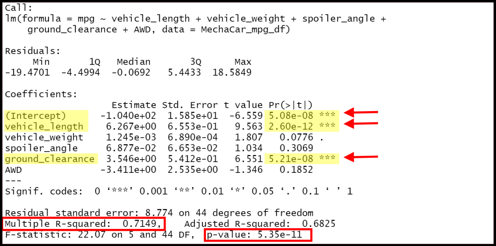

# MechaCar Statistical Analysis
<!-- Automotive statistical testing using the R programming language (Rice Bootcamp) -->
## Project Overview
The newest prototype from AutosRUs, the MechaCar, is suffering from production troubles that are blocking the manufacturing team’s progress.  Production data is to be reviewed for insights that may help the manufacturing team, specifically:
- Perform multiple linear regression analysis to identify which variables in the dataset predict the mpg of MechaCar prototypes
- Collect summary statistics on the pounds per square inch (PSI) of the suspension coils from the manufacturing lots
- Run t-tests to determine if the manufacturing lots are statistically different from the mean population
- Design a statistical study to compare vehicle performance of the MechaCar vehicles against vehicles from other manufacturers. For each statistical analysis, you’ll write a summary interpretation of the findings.

## Purpose
The purpose of this project is to provide a statisitical analysis of automobile performance with R.

## Resources
### Data Sources & Analysis Scripts
1. [MechaCar_mpg.csv](Resources/MechaCar_mpg.csv)
2. [Suspension_Coil.csv](Resources/Suspension_Coil.csv)
3. [MechaCarChallenge.R](MechaCarChallenge.R)

### Software
***Table 1: Software & Library Versions***
| Software | Version |
| :--- | :---: |
| R | 4.2.1 (Funny-Looking Kid) |
| RStudio | 2022.07.1+554 (Spotted Wakerobin) |
| Visual Studio Code | 1.70.2 |

# Results
## Linear Regression to Predict MPG
<!-- You will earn a perfect score for Deliverable 1 by completing all requirements below:
- The MechaCar_mpg.csv file is imported and read into a dataframe (5 pt)
- An RScript is written for a linear regression model to be performed on all six variables (10 pt)
- An RScript is written to create the statistical summary of the linear regression model with the intended p-values (10 pt)
- There is a summary that addresses all three questions (5 pt) -->
A multiple linear regression performed on the [MPG data](Resources/MechaCar_mpg.csv) yielded:

***Equation 1: MPG Multiple Linear Regression***
$$\text{mpg} = 6.267*\text{vehicle\\_length} + 0.001245*\text{vehicle\\_weight} + 0.06877*\text{spoiler\\_angle} + 3.546*\text{ground\\_clearance} - 3.411*\text{AWD} - 104 $$

The summary statistical metrics for **Equation 1** are:

***Figure 1: MPG Multiple Linear Regression Statistical Metrics***

As shown in **Figure 1**, the `Pr(>|t|)` values indicate that *vehicle_length* and *ground_clearance* are the known variables most likely to have a statistically significant impact on *mpg*.  The *intercept* for **Equation 1** is also statistically significant, which may indicate that there are additional unidentified factors to be considered.

The regression is has a non-zero slope, as the calculated `p-value` is 5.35e-11, well below the 0.05% threshhold for signifigance.   The `r-squared value` of 0.7149 indicates a generally strong correlation, so this linear model should be effective in estimating mpg of MechaCar prototypes.

## Summary Statistics on Suspension Coils
<!-- You will earn a perfect score for Deliverable 2 by completing all requirements below:
- The Suspension_Coil.csv file is imported and read into a dataframe (5 pt)
- An RScript is written to create a total summary dataframe that has the mean, median, variance, and standard deviation of the PSI for all manufacturing lots (10 pt)
- An RScript is written to create a lot summary dataframe that has the mean, median, variance, and standard deviation for each manufacturing lot (10 pt)
- There is a summary that addresses the design specification requirement for all the manufacturing lots and each lot individually (5 pt) -->
The design specifications for the MechaCar suspension coils dictate that the variance of the suspension coils must not exceed 100 pounds per square inch.  Summary statistics have been compiled for all suspension coils and for each manufacturing lot:

***Figure 2: Summary Statistics for All Suspension Coils***

***Figure 3: Summary Statistics for Suspension Coils by Manufacuring Lot***

While **Figure 2** shows that overall manufacture meets the specification, examination of **Figure 3** reveals excessive variance in the coils from Manufacturing Lot 3.  The 70% increased spread at Lot 3 should be analyzed further to determine the root cause. If the performance lag is not due to an already identified and documented cause, a full qudit / gap assessment may be required of Lot 3's records and procedures (e.g. NCRs, equipment maintenance logs, incoming material receipts).

## T-Test on Suspension Coils
<!-- You will earn a perfect score for Deliverable 3 by completing all requirements below:
- An RScript is written for t-test that compares all manufacturing lots against mean PSI of the population (5 pt)
- An RScript is written for three t-tests that compare each manufacturing lot against mean PSI of the population (10 pt)
- There is a summary of the t-test results across all manufacturing lots and for each lot (5 pt) -->
One-sample T-tests were used to determine if all manufacturing lots and each lot individually are statistically different from the population mean of 1,500 pounds per square inch.  A standard signifigance threshhold of 5% is assumed.  The results are:

***Figure 4: One-Sample T-Test for All Suspension Coils***

***Figure 5: One-Sample T-Test for Manufacuring Lot 1***

***Figure 6: One-Sample T-Test for Manufacuring Lot 2***

***Figure 7: One-Sample T-Test for Manufacuring Lot 3***

As shown in **Figures 4 to 6**, the associated `p-values` are well above 5%, indicating that the overall manufacture, and both Lot 1 and Lot 2 suspension coils are not statistically different from the prescribed population mean of 1,500 pounds per square inch.  On the other hand, the Lot 3 `p-value` of 4.168% in **Figure 7** is statistically different, and further supports the reccommendation in the previous section to investigate the root cause.  

## Study Design: MechaCar vs Competition
<!-- The statistical study design has the following:
- A metric to be tested is mentioned (5 pt)
- A null hypothesis or an alternative hypothesis is described (5 pt)
- A statistical test is described to test the hypothesis (5 pt)
- The data for the statistical test is described (5 pt) -->
After reviewing recent automotive studies [^1][^2][^3] for key factors consumers value in new cars, the following metrics are recommended for the statistical analysis of AutoRUs' primary competitors:
- Base Manufacturer Suggested Retail Price (MSRP)
- National Highway Traffic Safety Administration (NHTSA) safety rating 
- Fuel economy (mpg)
- Advanced safety features (e.g. blind spot warning/alert, automatic emergency braking, lane departure warning)
- Convenience / connectivity features (e.g. Apple CarPlay/Android Auto interface, car voice commands)
- Fuel capacity
- Passenger / Seating Capacity
- Front Head Room (inches)
- Front Leg Room (inches)
- Cargo space

The study null hypothesis would be: each performance metrics is statistically similar between the MechaCar prototype and all vehicle from the other manufacturers.

As a judge of monetary value and competitive edge, it is recommended to use the Base MSRP as the **dependent variable**.  The analysis would consist of a one-way ANOVA  to analyze the difference between the means of the 2+ groups. 

Data gathering for this analysis can be broken down into the following tasks:
1. Compile internal data for MechaCar vehicles.
2. Agree specific list of primary competitor vehicles for comparison.
3. Gather competitor data, potentially from web scraping *Car and Driver* or *Kelly Blue Book*.
4. Review, verify, and compile all data for MechaCar vehicles and competitors into a single dataframe. 

[^1]: Holmes, Freddie.  "What do consumers want from the car of the future?". *Automotive World*.  [https://www.transportation.gov/utc/bike-sharing-popularity-grows-system-matures](https://www.automotiveworld.com/articles/what-do-consumers-want-from-the-car-of-the-future/)  Published: 19 September 2019.  Accessed: 24 August 2022.
[^2]: Laya, Andres, Neha Vyas, and Gunnar Ehrnborg.  "2020 consumer trends in the automotive industry: Is this the end of the consumer car?" *The Ericsson Blog*. [https://www.ericsson.com/en/blog/2020/12/consumer-trends-automotive-industry-2020](https://www.ericsson.com/en/blog/2020/12/consumer-trends-automotive-industry-2020) Published: 02 December 2020.  Accessed: 24 August 2022.
[^3]: Deloitte. "2021 Global Automotive Consumer Study".  [https://www2.deloitte.com/us/en/pages/consumer-business/articles/global-automotive-consumer-study.html](https://www2.deloitte.com/us/en/pages/consumer-business/articles/global-automotive-consumer-study.html)  Published: 22 June 2021. Accessed: 24 August 2022.

